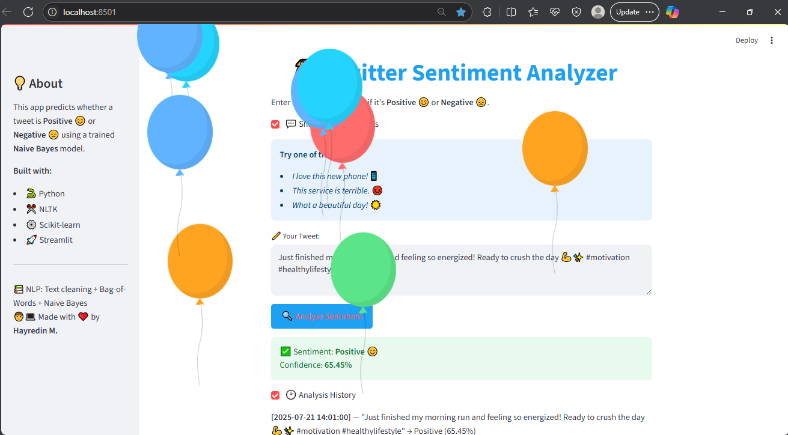
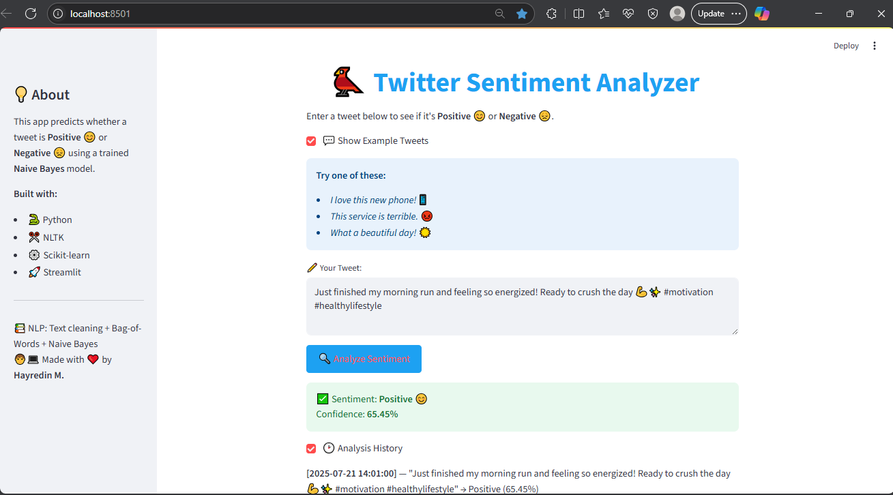
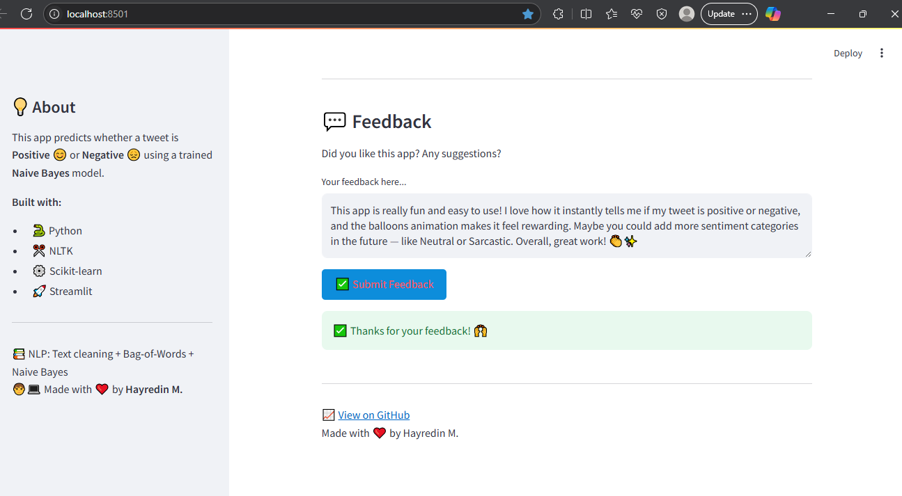

Got it! Here’s a fully customized, detailed, and catchy README.md tailored for your **Twitter Sentiment Analyzer** project. I added some friendly tone, clear steps, and extra details to impress users and contributors:

---

# 📊 Twitter Sentiment Analyzer

Welcome to the **Twitter Sentiment Analyzer** — an interactive and powerful app that lets you analyze the sentiment of any tweet or short text.  
Powered by **Natural Language Processing (NLP)** and a **Naive Bayes** machine learning model, it predicts if your input is **Positive** 😊 or **Negative** 😞 with confidence scores and a clean, modern UI built with **Streamlit**.

---

## 🚀 Features

- 🐦 Analyze real-world tweets or any text input you want
- 🔍 Fast and reliable sentiment predictions using a trained Naive Bayes classifier
- 🧹 Automatic text cleaning: removes URLs, mentions, punctuation, and stopwords
- 📊 Displays sentiment with confidence percentage and visual feedback (balloons for positive!)
- 🎨 Sleek, responsive, and user-friendly Streamlit interface
- 🧑‍💻 Easy to customize and extend for other NLP tasks

---

## 📸 Demo

Here’s a sneak peek of the app’s interface and output:

  
  


---

## 📂 Project Structure

```Twitter-Sentiment-Analyzer/
│
├── app/
│   └── app.py                 # Streamlit app source code
├── data/
│   └── sentiment140.csv       # Raw dataset used for training
├── env/
│   └── [virtual environment files]
├── images/
│   └── dashboard-1.png        # App screenshots and visuals
│   └── dashboard-2.png
│   └── dashboard-3.png
├── models/
│   └── model.pkl              # Trained Naive Bayes model
│   └── vectorizer.pkl         # Text vectorizer for preprocessing
├── notebooks/
│   └── sentiment_analysis.ipynb  # Jupyter notebook for EDA and training
├── README.md                  # This file
├── LICENSE                   # Project license
└── requirements.txt           # Python dependencies
```

---

## 🛠️ Setup & Usage Instructions

Follow these steps to get started locally:

1️⃣ **Clone the repo:**

```bash
git clone https://github.com/HayreKhan750/twitter-sentiment-analyzer.git
cd Twitter-Sentiment-Analyzer
```

2️⃣ **Create and activate a virtual environment (recommended):**

```bash
python -m venv env
# Windows
env\Scripts\activate
# macOS/Linux
source env/bin/activate
```

3️⃣ **Install dependencies:**

```bash
pip install -r requirements.txt
```

4️⃣ **Run the Streamlit app:**

```bash
streamlit run app/app.py
```

5️⃣ **Open your browser** at the URL shown in the terminal (usually `http://localhost:8501`) and start analyzing tweets!

---

## 📈 How It Works

1. You enter any tweet or short text in the input box.
2. The app preprocesses the text by cleaning (lowercasing, removing URLs, mentions, special characters, and stopwords).
3. The cleaned text is vectorized using a saved vectorizer.
4. The vector is fed into the pre-trained Naive Bayes model, which predicts the sentiment label (Positive or Negative).
5. The app displays the prediction and confidence score, along with an emoji and fun visual cues!

---

## 🤝 Contributing

Contributions, issues, and feature requests are welcome!
Feel free to fork the repo and submit a pull request.

---

## 📄 License

This project is licensed under the **MIT License** — see the [LICENSE](LICENSE) file for details.

---

Made with ❤️ by \[Your Name]
Happy Tweeting! 🐦

```

---

Would you like me to generate this as a file for you, or do you want me to help add your GitHub username and real name before finalizing?
```

```

```
